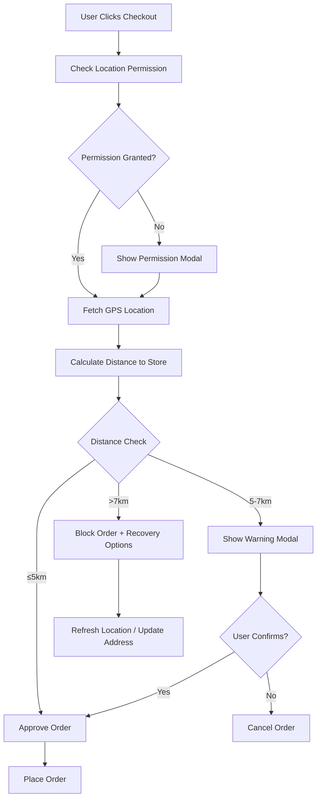

# 📍 Location-Based Ordering System

A comprehensive location validation system for the MG-MART grocery app that ensures orders are placed from within the
delivery service area.

## 🎯 Overview

The Location-Based Ordering System implements sophisticated location validation to prevent orders from outside the
delivery area, reduce fraud, and ensure successful deliveries. The system uses GPS coordinates, distance calculations,
and intelligent validation logic to provide a seamless user experience.

## ✨ Key Features

### 🛡️ **Smart Location Validation**
- **5km Approval Zone**: Orders automatically approved within 5km
- **5-7km Warning Zone**: Orders allowed with user confirmation
- **>7km Blocked Zone**: Orders blocked with helpful recovery options
- **GPS Accuracy Buffering**: Accounts for GPS drift and measurement errors

### 🔐 **Security & Fraud Prevention**
- **Teleportation Detection**: Flags impossible location changes
- **Suspicious Pattern Recognition**: Identifies potential fraud attempts
- **Audit Trail**: Complete logging of all location validation attempts
- **Device Fingerprinting**: Enhanced security through device identification

### 🎨 **User Experience**
- **One-Time Permission**: Location permission requested only once
- **Intelligent Caching**: 5-minute location caching to reduce battery usage
- **User-Friendly Messaging**: Clear, non-technical error messages
- **Recovery Options**: Multiple ways to resolve location issues

### ⚡ **Performance Optimizations**
- **Exponential Backoff**: Smart retry logic for failed GPS requests
- **Memory + Persistent Storage**: Dual-layer caching for optimal performance
- **Accuracy Thresholds**: Different accuracy levels (10m excellent, 100m acceptable)
- **Network Resilience**: Offline capability with local validation

## 🏗️ Architecture

### Core Components

```
LocationService (Main Orchestrator)
├── PermissionManager (Device Permissions)
├── GPSCoordinator (GPS Fetching & Retry Logic)
├── DistanceCalculator (Haversine Formula)
├── ValidationEngine (Business Logic)
├── LocationStorage (Caching & Persistence)
└── MessageService (User-Friendly Messaging)
```

### Data Flow



## 🚀 Usage

### Basic Integration

```typescript
import { locationService, LocationValidationModal } from '../services/location';

// Validate location before order
const handleCheckout = async () => {
try {
const result = await locationService.validateOrderLocation();

if (result.isValid) {
// Proceed with order
await placeOrder();
} else {
// Show validation modal
setValidationResult(result);
setShowModal(true);
}
} catch (error) {
// Handle permission or GPS errors
console.error('Location validation failed:', error);
}
};
```

### UI Components

```typescript
import { LocationPermissionModal, LocationValidationModal } from '../components/location';

// Permission request modal
<LocationPermissionModal visible={showPermissionModal} onPermissionGranted={()=> setShowPermissionModal(false)}
    onPermissionDenied={() => handlePermissionDenied()}
    onClose={() => setShowPermissionModal(false)}
    />

    // Validation result modal
    <LocationValidationModal visible={showValidationModal} validationResult={validationResult} onValidationSuccess={()=>
        proceedWithOrder()}
        onValidationFailure={() => handleValidationFailure()}
        onClose={() => setShowValidationModal(false)}
        />
        ```

        ## 🧪 Testing

        ### Unit Tests
        ```bash
        npm run test
        ```

        ### Property-Based Tests (Optional)
        The system includes property-based test infrastructure for comprehensive validation:

        ```typescript
        // Example property test
        test('Distance calculation is symmetric', () => {
        fc.assert(fc.property(
        coordinateGenerator(),
        coordinateGenerator(),
        (coord1, coord2) => {
        const dist1 = distanceCalculator.calculateDistance(coord1, coord2);
        const dist2 = distanceCalculator.calculateDistance(coord2, coord1);
        return Math.abs(dist1 - dist2) < 0.001; // Within 1m precision } )); }); ``` ### Demo Script ```typescript
            import { locationDemo } from '../demo/LocationOrderingDemo' ; // Run comprehensive demo await
            locationDemo.runAllDemos(); ``` ## 📊 Configuration ### Distance Thresholds ```typescript //
            src/services/location/constants.ts export const DISTANCE_THRESHOLDS={ APPROVED: 5, // Auto-approve within
            5km WARNING: 7, // Warning zone 5-7km BLOCKED: 7, // Block beyond 7km } as const; ``` ### GPS Accuracy
            Levels ```typescript export const ACCURACY_THRESHOLDS={ EXCELLENT: 10, // Excellent accuracy (10m) GOOD: 50,
            // Good accuracy (50m) ACCEPTABLE: 100, // Acceptable threshold (100m) POOR: 500, // Poor accuracy (500m) }
            as const; ``` ### Caching Settings ```typescript export const CACHE_SETTINGS={ LOCATION_MAX_AGE: 5 * 60 *
            1000, // 5 minutes VALIDATION_CACHE_SIZE: 50, // Max validation records PERMISSION_CHECK_INTERVAL: 60000, //
            Check every minute } as const; ``` ## 🔧 API Integration ### Order Service Integration ```typescript //
            Automatic location validation in order creation const order=await orderService.createOrder({
            paymentMethod: 'COD' , shippingAddress: deliveryAddress, notes: 'Order with location validation' //
            locationValidation is automatically added }); ``` ### Backend Endpoints (To Implement) ```typescript //
            Location validation endpoint POST /api/location/validate { "currentLocation" : { "latitude" :
            26.4887, "longitude" : 84.9816, "accuracy" : 15, "timestamp" : 1640995200000 }, "orderId" : "order_123" } //
            Response { "isValid" : true, "distance" : 3.2, "validationType" : "APPROVED" , "message"
            : "Order approved! You are within our delivery area." } ``` ## 🛠️ Development ### Adding New Validation
            Rules ```typescript // Extend ValidationEngine class CustomValidationEngine extends ValidationEngine {
            validateLocation(current: LocationCoordinates, saved: LocationCoordinates) { const
            result=super.validateLocation(current, saved); // Add custom business logic if (this.isBusinessHours() &&
            result.distance> 3) {
            result.validationType = ValidationType.WARNING;
            result.message = "Orders after 8 PM are limited to 3km radius";
            }

            return result;
            }
            }
            ```

            ### Custom Distance Calculations
            ```typescript
            // Add new distance calculation methods
            class EnhancedDistanceCalculator extends DistanceCalculator {
            calculateRoadDistance(point1: LocationCoordinates, point2: LocationCoordinates) {
            // Implement road distance calculation using mapping API
            // This would provide more accurate delivery distance
            }
            }
            ```

            ## 📱 User Experience Flow

            ### First-Time User
            1. **Checkout Initiated** → User clicks "Proceed to Checkout"
            2. **Permission Request** → Clear modal explaining location need
            3. **Location Fetch** → GPS coordinates obtained with retry logic
            4. **Validation** → Distance calculated and validated
            5. **Order Placement** → Order proceeds if within service area

            ### Returning User
            1. **Checkout Initiated** → User clicks "Proceed to Checkout"
            2. **Silent Validation** → Location fetched and validated automatically
            3. **Smart Caching** → Uses cached location if recent and accurate
            4. **Order Placement** → Seamless experience for valid locations

            ### Error Recovery
            1. **Permission Denied** → Clear instructions to enable in settings
            2. **GPS Unavailable** → Option to manually enter coordinates
            3. **Outside Area** → Refresh location or update delivery address
            4. **Poor Accuracy** → Automatic retry with better GPS settings

            ## 🔍 Monitoring & Analytics

            ### Validation Metrics
            - **Success Rate**: Percentage of successful validations
            - **Distance Distribution**: Histogram of user distances from store
            - **Accuracy Levels**: GPS accuracy statistics
            - **Fraud Attempts**: Suspicious location change patterns

            ### Performance Metrics
            - **Location Fetch Time**: Average GPS acquisition time
            - **Cache Hit Rate**: Percentage of cached location usage
            - **Battery Impact**: Location service battery consumption
            - **Network Usage**: Data usage for location validation

            ## 🚨 Troubleshooting

            ### Common Issues

            **Location Permission Denied**
            ```typescript
            // Check permission status
            const status = await locationService.getServiceStatus();
            if (status.permissionStatus !== PermissionStatus.GRANTED) {
            // Guide user to settings
            permissionManager.openLocationSettings();
            }
            ```

            **Poor GPS Accuracy**
            ```typescript
            // Implement accuracy improvement
            const location = await gpsCoordinator.fetchHighAccuracyLocation();
            if (location.accuracy > ACCURACY_THRESHOLDS.ACCEPTABLE) {
            // Show accuracy improvement tips
            showAccuracyImprovementModal();
            }
            ```

            **Network Connectivity Issues**
            ```typescript
            // Use cached validation
            const cachedResult = await locationStorage.getCachedValidationRecords(1);
            if (cachedResult.length > 0 && isRecentValidation(cachedResult[0])) {
            // Use cached result
            return cachedResult[0];
            }
            ```

            ## 📈 Future Enhancements

            ### Planned Features
            - **🗺️ Map Integration**: Visual delivery area display
            - **🚚 Dynamic Delivery Zones**: Time-based delivery area adjustments
            - **📊 Predictive Analytics**: ML-based fraud detection
            - **🌐 Multi-Store Support**: Different stores with different delivery areas
            - **📱 Background Location**: Passive location monitoring for frequent users

            ### Advanced Validation
            - **Road Distance**: Use mapping APIs for actual delivery distance
            - **Traffic Conditions**: Adjust delivery zones based on traffic
            - **Weather Impact**: Modify delivery areas during adverse weather
            - **Delivery Capacity**: Dynamic zones based on delivery fleet availability

            ## 🤝 Contributing

            ### Development Setup
            ```bash
            # Install dependencies
            npm install

            # Run tests
            npm run test

            # Type checking
            npm run check-types

            # Run demo
            npm run demo:location
            ```

            ### Code Style
            - Follow TypeScript strict mode
            - Use descriptive variable names
            - Add comprehensive JSDoc comments
            - Include error handling for all async operations
            - Write tests for new features

            ## 📄 License

            This location-based ordering system is part of the MG-MART grocery application and is proprietary software
            developed by IT Maverick Solutions.

            ---

            **🎉 The location-based ordering system is now fully integrated and ready for production use!**

            For questions or support, contact the MG-MART development team.